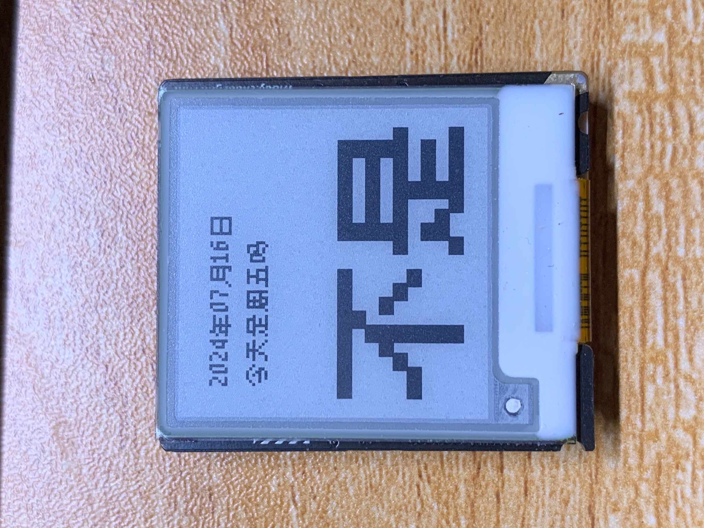
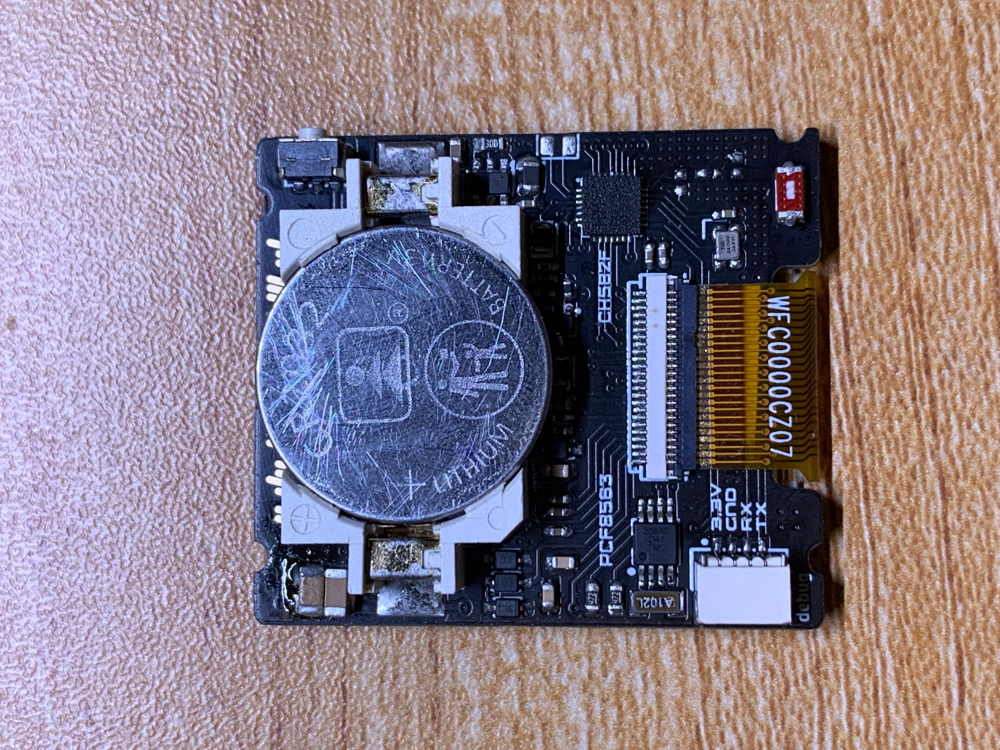
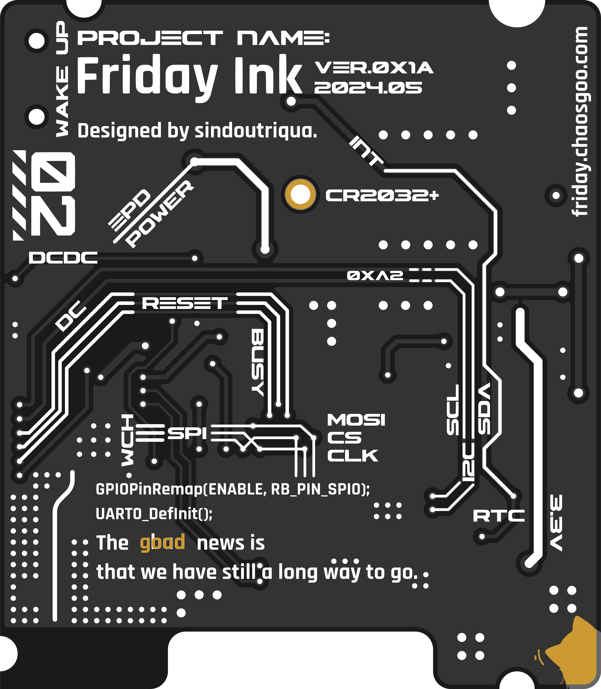
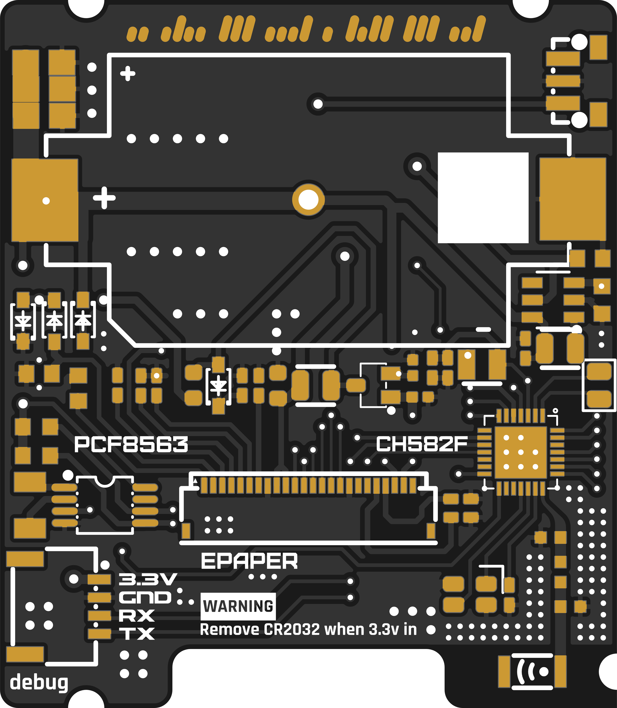
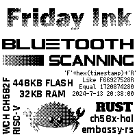
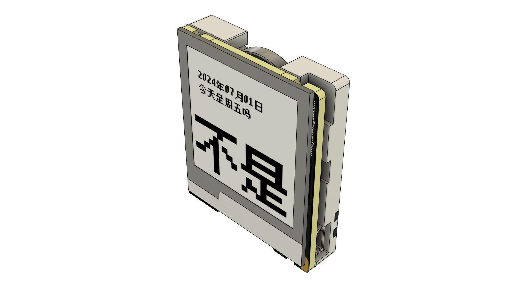
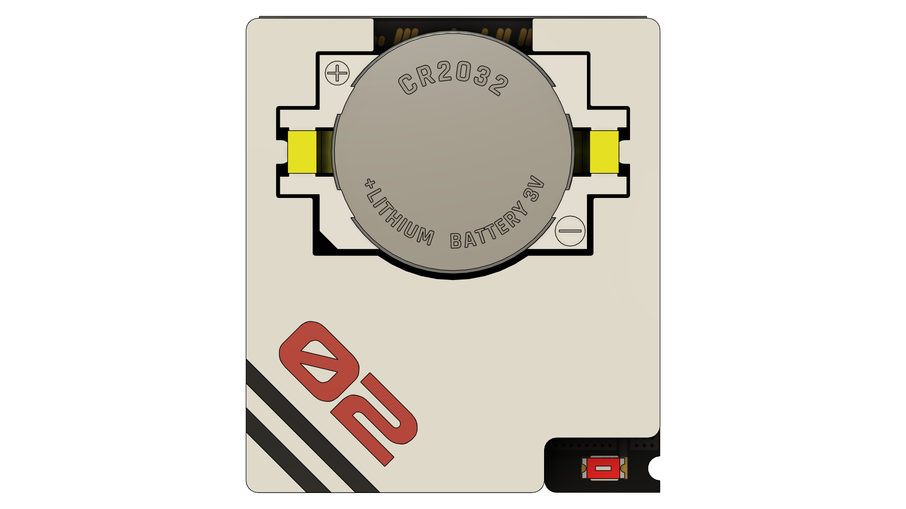
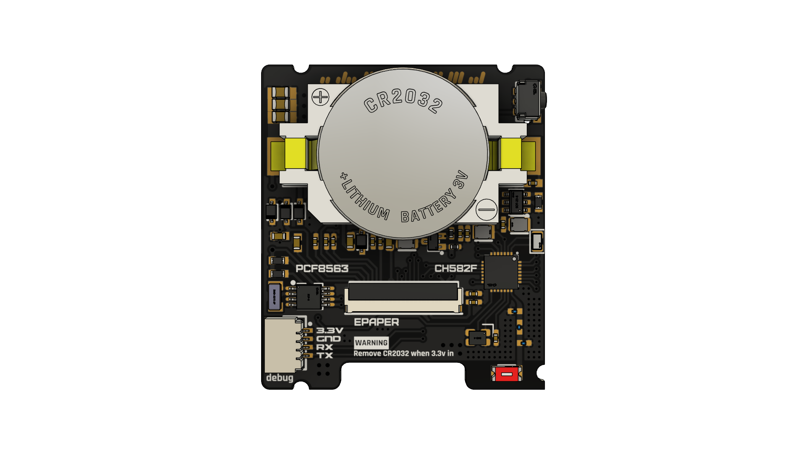
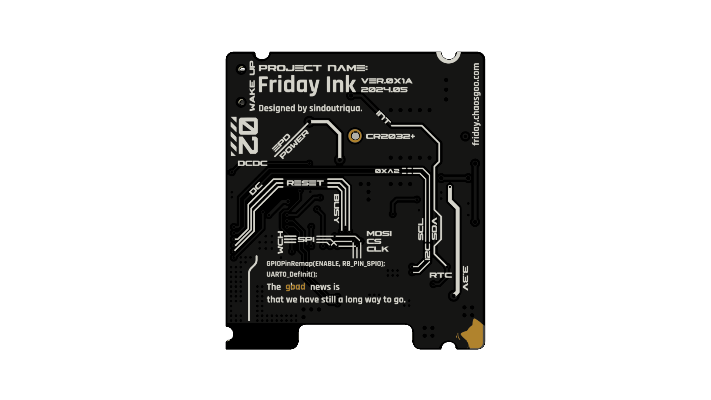

# 今天是周五吗

[bilibili视频介绍](https://www.bilibili.com/video/BV1gf8TerEiX)
[MakerWorld地址](https://makerworld.com.cn/zh/models/375640)

Top | Bottom
-|-
 | 

这是一个使用CH582F作为主控, 电子墨水屏为显示载体, 由一颗CR2032纽扣电池驱动的装置.

其本质上是一个日历, 但是加入了周五的判断, 使其成为一个周五检测器.

`受即刻App的iOS小部件启发而来`

## PCB 预览
Top | Bottom
-|-
 | 

## 基础参数

### 硬件参数
* 主控 CH582F 32KB Ram + 448KB Flash
* 时钟芯片 PCF8563T
* 屏幕 1.54英寸墨水屏 SSD1607
* DCDC芯片 SGM6603-3.3YN6G
* 电源 CR2032电池

### 尺寸
* 34mm×39mm×8mm

### 耗电信息
* 休眠状态下≈3μA
* 刷新 10~20mA, 持续5秒后会立刻进入休眠

## 时间校准说明
开机时候长按按钮, 进入时间同步模式, 并在看见如下图后松开按钮

此时装置将会搜索周围的蓝牙广播.当搜索到符合约定格式的时间广播适合会自动重启.

时间广播格式为`'F' + 时间戳的16进制字符串 + 'R'`, 可以使用名为`Friday Ink时间同步`的小程序进行时间同步.

当进入时间同步模式后20s内无法搜索到符合要求的时间广播,会自动退出同步.

## 编译及烧录
推荐在Linux环境下进行编译, 这里我使用的是WSL2内的ubuntu子系统.
1. clone 本项目, cd进入后执行`git submodule update --init --recursive`
2. 安装Rust
3. 跟着[riscv-gnu-toolchain](https://github.com/riscv-collab/riscv-gnu-toolchain)仓库的Release界面下载riscv32-elf-ubuntu-22.04-gcc-nightly,配置好环境变量
4. 根据你的MRS_Community配置u8g2_rs内的build.rs中头文件目录
5. 执行`cargo build-hex`获得编译好的hex文件
6. 使用WCHISPStudio工具串口模式下载得到的hex文件

## 设定集

## Q&A

### Q: 时间校准时候卡在校准页怎么办
### A: 推荐提前发送时间广播, 让手机和装置足够接近. 然后装置进入校准, 并在发现20S后未能自动退出校准或按钮无法强制退出校准时, 取下电池, 重新安装电池.

## 已知问题
* 时间校准有一定概率卡死在校准页
